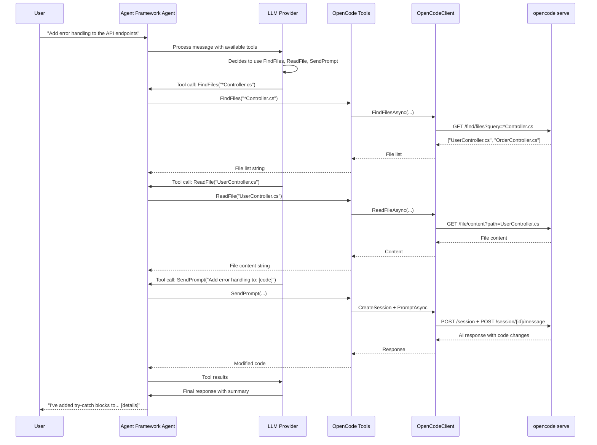

# Integration Option 2: OpenCode as Agent Framework Tools

## Overview

Register OpenCode client operations as tools (functions) that any Microsoft Agent Framework agent can invoke. This allows agents powered by OpenAI, Anthropic, Azure OpenAI, or other providers to leverage OpenCode's local AI coding capabilities and file/search operations.

The local server API (`opencode serve`) provides:
- **Session-based AI conversations**: Create sessions and send prompts to an AI agent
- **File operations**: List, read, and search files in the project
- **Code search**: Find text, files, and symbols across the codebase
- **PTY operations**: Execute shell commands and manage terminal sessions
- **VCS integration**: Get git status and diff information

## Architecture

```
┌─────────────────────────────────────────┐
│     Microsoft Agent Framework Agent     │
│  (OpenAI, Anthropic, Azure OpenAI, etc) │
└────────────────┬────────────────────────┘
                 │
                 │ Calls tools when needed
                 ▼
┌─────────────────────────────────────────┐
│         OpenCode Function Tools         │
├─────────────────────────────────────────┤
│ • SendPromptTool (AI conversations)     │
│ • ReadFileTool                          │
│ • FindTextTool (grep-like search)       │
│ • FindFilesTool (file pattern search)   │
│ • FindSymbolsTool (code symbols)        │
│ • GetSessionDiffTool                    │
│ • ExecuteShellTool                      │
└────────────────┬────────────────────────┘
                 │
                 │ Delegates to
                 ▼
┌─────────────────────────────────────────┐
│          IOpenCodeClient                │
│    (connects to opencode serve)         │
└─────────────────────────────────────────┘
```

## Key Benefits

1. **Universal Access**: Any Agent Framework agent can use OpenCode's local AI and file operations
2. **Automatic Tool Selection**: LLMs decide when to use OpenCode tools based on context
3. **Hybrid Intelligence**: Use one model for orchestration, delegate to OpenCode's configured model for code tasks
4. **Local-First**: All operations run locally via `opencode serve` - no cloud API required
5. **Rich Context**: OpenCode sessions maintain full conversation history and project context

## Implementation

### Step 1: Create OpenCode Tool Wrapper

```csharp
using System.ComponentModel;
using LionFire.OpenCode.Serve;
using LionFire.OpenCode.Serve.Models;

public class OpenCodeTools
{
    private readonly IOpenCodeClient _client;
    private readonly string _directory;
    private string? _sessionId;

    public OpenCodeTools(IOpenCodeClient client, string directory)
    {
        _client = client;
        _directory = directory;
    }

    [Description("Send a prompt to the OpenCode AI assistant and get a response. " +
                 "Use this for code generation, explanation, review, refactoring, and general coding questions.")]
    public async Task<string> SendPrompt(
        [Description("The prompt or question to send to the AI assistant")] string prompt,
        CancellationToken cancellationToken = default)
    {
        // Create or reuse session
        if (_sessionId == null)
        {
            var session = await _client.CreateSessionAsync(
                directory: _directory,
                cancellationToken: cancellationToken);
            _sessionId = session.Id;
        }

        var request = new SendMessageRequest
        {
            Parts = new List<PartInput>
            {
                new TextPartInput { Type = "text", Text = prompt }
            }
        };

        var response = await _client.PromptAsync(_sessionId, request, _directory, cancellationToken);

        // Extract text content from response parts
        var textParts = response.Parts?
            .OfType<TextPart>()
            .Select(p => p.Text)
            .Where(t => !string.IsNullOrEmpty(t));

        return string.Join("\n", textParts ?? Enumerable.Empty<string>());
    }

    [Description("Read the contents of a file from the project")]
    public async Task<string> ReadFile(
        [Description("Path to the file (relative to project root)")] string path,
        CancellationToken cancellationToken = default)
    {
        var content = await _client.ReadFileAsync(path, _directory, cancellationToken);
        return content.Content ?? string.Empty;
    }

    [Description("Search for text patterns in files (grep-like functionality)")]
    public async Task<string> FindText(
        [Description("Text or regex pattern to search for")] string query,
        CancellationToken cancellationToken = default)
    {
        var results = await _client.FindTextAsync(query, _directory, cancellationToken);
        return string.Join("\n", results);
    }

    [Description("Find files matching a pattern")]
    public async Task<string> FindFiles(
        [Description("File name or glob pattern to search for")] string query,
        CancellationToken cancellationToken = default)
    {
        var results = await _client.FindFilesAsync(query, directory: _directory, cancellationToken: cancellationToken);
        return string.Join("\n", results);
    }

    [Description("Search for code symbols (classes, functions, variables)")]
    public async Task<string> FindSymbols(
        [Description("Symbol name to search for")] string query,
        CancellationToken cancellationToken = default)
    {
        var results = await _client.FindSymbolsAsync(query, _directory, cancellationToken);
        return string.Join("\n", results.Select(s =>
            $"{s.Name} ({s.Kind}) - {s.Location?.Path}:{s.Location?.Range?.Start?.Line}"));
    }

    [Description("List files in a directory")]
    public async Task<string> ListFiles(
        [Description("Directory path to list (relative to project root)")] string path,
        CancellationToken cancellationToken = default)
    {
        var files = await _client.ListFilesAsync(path, _directory, cancellationToken);
        return string.Join("\n", files.Select(f => f.IsDirectory ? $"[DIR] {f.Name}" : f.Name));
    }

    [Description("Get the diff of changes made in the current session")]
    public async Task<string> GetSessionDiff(
        CancellationToken cancellationToken = default)
    {
        if (_sessionId == null)
            return "No active session";

        var diffs = await _client.GetSessionDiffAsync(_sessionId, directory: _directory, cancellationToken: cancellationToken);
        return string.Join("\n\n", diffs.Select(d =>
            $"--- {d.Path}\n{d.Content}"));
    }

    [Description("Get git status and version control information")]
    public async Task<string> GetVcsInfo(
        CancellationToken cancellationToken = default)
    {
        var vcs = await _client.GetVcsInfoAsync(_directory, cancellationToken);
        return $"Branch: {vcs.Branch}\nCommit: {vcs.Sha}\nDirty: {vcs.Dirty}";
    }
}
```

### Step 2: Register Tools with Agent

```csharp
using Microsoft.Extensions.AI;
using LionFire.OpenCode.Serve;

// Create OpenCode client (connects to local opencode serve)
await using var openCodeClient = new OpenCodeClient("http://localhost:9377");

// Create tools from OpenCode wrapper
var openCodeTools = new OpenCodeTools(openCodeClient, "/path/to/project");
var tools = AIFunctionFactory.Create(openCodeTools);

// Create agent with any LLM provider (e.g., Azure OpenAI)
var endpoint = Environment.GetEnvironmentVariable("AZURE_OPENAI_ENDPOINT")!;
var deploymentName = Environment.GetEnvironmentVariable("AZURE_OPENAI_DEPLOYMENT")!;

var agent = new AzureOpenAIClient(new Uri(endpoint), new AzureCliCredential())
    .GetChatClient(deploymentName)
    .AsIChatClient()
    .AsBuilder()
    .UseFunctionInvocation()
    .Build();

var options = new ChatOptions { Tools = tools };

// Agent can now use OpenCode tools automatically
var messages = new List<ChatMessage>
{
    new(ChatRole.System, "You are a helpful coding assistant. Use the available tools to help with code tasks."),
    new(ChatRole.User, "Find all files that contain 'TODO' comments and summarize what needs to be done")
};

var response = await agent.GetResponseAsync(messages, options);
Console.WriteLine(response);
```

### Step 3: Use with Dependency Injection

```csharp
// Program.cs
var builder = WebApplication.CreateBuilder(args);

// Register OpenCode client
builder.Services.AddSingleton<IOpenCodeClient>(sp =>
    new OpenCodeClient(builder.Configuration["OpenCode:BaseUrl"] ?? "http://localhost:9377"));

// Register OpenCode tools (scoped per request to maintain session state)
builder.Services.AddScoped(sp =>
{
    var client = sp.GetRequiredService<IOpenCodeClient>();
    var projectDir = builder.Configuration["OpenCode:ProjectDirectory"] ?? ".";
    return new OpenCodeTools(client, projectDir);
});

// Register tool functions
builder.Services.AddScoped(sp =>
{
    var tools = sp.GetRequiredService<OpenCodeTools>();
    return AIFunctionFactory.Create(tools);
});
```

## Usage Examples

### Example 1: Code Understanding Task

```csharp
var messages = new List<ChatMessage>
{
    new(ChatRole.User, "What does the UserService class do? Show me the main methods.")
};

// Agent automatically:
// 1. Calls FindSymbols("UserService") to locate the class
// 2. Calls ReadFile to get the source code
// 3. Summarizes the functionality
var response = await agent.GetResponseAsync(messages, options);
```

### Example 2: Code Modification Task

```csharp
var messages = new List<ChatMessage>
{
    new(ChatRole.User, "Add input validation to the RegisterUser method in UserService.cs")
};

// Agent automatically:
// 1. Calls ReadFile("UserService.cs") to get current code
// 2. Calls SendPrompt with the modification request
// 3. Returns the suggested changes
var response = await agent.GetResponseAsync(messages, options);

// Get the diff of changes
var diff = await openCodeTools.GetSessionDiff();
Console.WriteLine($"Changes made:\n{diff}");
```

### Example 3: Code Search and Analysis

```csharp
var messages = new List<ChatMessage>
{
    new(ChatRole.User, "Find all usages of deprecated APIs and suggest replacements")
};

// Agent automatically:
// 1. Calls FindText for deprecated patterns
// 2. Calls SendPrompt to analyze and suggest replacements
var response = await agent.GetResponseAsync(messages, options);
```

### Example 4: Multi-Step Conversation

```csharp
// Start a coding session
messages.Add(new(ChatRole.User, "Let's refactor the authentication module"));

// Agent creates session and responds
var response1 = await agent.GetResponseAsync(messages, options);
messages.Add(response1.Message);

// Continue the conversation
messages.Add(new(ChatRole.User, "Now add unit tests for the changes"));
var response2 = await agent.GetResponseAsync(messages, options);

// The OpenCode session maintains context across prompts
```

## Tool Invocation Flow



## Advanced Patterns

### Pattern 1: Session Management Tools

```csharp
public class OpenCodeSessionTools
{
    private readonly IOpenCodeClient _client;
    private readonly string _directory;
    private readonly Dictionary<string, string> _namedSessions = new();

    [Description("Create a new named session for a specific task")]
    public async Task<string> CreateNamedSession(
        [Description("Name for this session (e.g., 'refactoring', 'bugfix')")] string name,
        [Description("Optional title for the session")] string? title = null,
        CancellationToken cancellationToken = default)
    {
        var session = await _client.CreateSessionAsync(
            new CreateSessionRequest { Title = title ?? name },
            _directory,
            cancellationToken);

        _namedSessions[name] = session.Id;
        return $"Created session '{name}' with ID {session.Id}";
    }

    [Description("Send a prompt to a specific named session")]
    public async Task<string> SendToSession(
        [Description("Name of the session to use")] string sessionName,
        [Description("The prompt to send")] string prompt,
        CancellationToken cancellationToken = default)
    {
        if (!_namedSessions.TryGetValue(sessionName, out var sessionId))
            return $"Session '{sessionName}' not found. Create it first.";

        var request = new SendMessageRequest
        {
            Parts = new List<PartInput> { new TextPartInput { Type = "text", Text = prompt } }
        };

        var response = await _client.PromptAsync(sessionId, request, _directory, cancellationToken);
        return ExtractTextFromResponse(response);
    }

    [Description("Fork an existing session to try an alternative approach")]
    public async Task<string> ForkSession(
        [Description("Name of the session to fork")] string fromSession,
        [Description("Name for the new forked session")] string newName,
        CancellationToken cancellationToken = default)
    {
        if (!_namedSessions.TryGetValue(fromSession, out var sourceId))
            return $"Session '{fromSession}' not found";

        var forked = await _client.ForkSessionAsync(sourceId, directory: _directory, cancellationToken: cancellationToken);
        _namedSessions[newName] = forked.Id;
        return $"Forked '{fromSession}' to '{newName}'";
    }
}
```

### Pattern 2: Code Analysis Tools

```csharp
public class OpenCodeAnalysisTools
{
    private readonly IOpenCodeClient _client;
    private readonly string _directory;

    [Description("Analyze a file and provide a structured summary including classes, methods, and dependencies")]
    public async Task<string> AnalyzeFile(
        [Description("Path to the file to analyze")] string path,
        CancellationToken cancellationToken = default)
    {
        // Get file content
        var content = await _client.ReadFileAsync(path, _directory, cancellationToken);

        // Find symbols in the file
        var symbols = await _client.FindSymbolsAsync(
            Path.GetFileNameWithoutExtension(path),
            _directory,
            cancellationToken);

        var fileSymbols = symbols.Where(s => s.Location?.Path == path).ToList();

        // Create a session and ask for analysis
        var session = await _client.CreateSessionAsync(directory: _directory, cancellationToken: cancellationToken);

        var prompt = $"Analyze this code and provide a brief structured summary:\n\n```\n{content.Content}\n```\n\n" +
                     "Include: purpose, main classes/functions, dependencies, potential issues.";

        var request = new SendMessageRequest
        {
            Parts = new List<PartInput> { new TextPartInput { Type = "text", Text = prompt } }
        };

        var response = await _client.PromptAsync(session.Id, request, _directory, cancellationToken);

        return $"Symbols found: {fileSymbols.Count}\n\n{ExtractTextFromResponse(response)}";
    }

    [Description("Search for potential issues in the codebase")]
    public async Task<string> FindIssues(
        [Description("Type of issues to search for: security, performance, deprecated, todo")] string issueType,
        CancellationToken cancellationToken = default)
    {
        var searchPatterns = issueType.ToLower() switch
        {
            "security" => new[] { "password", "secret", "api_key", "eval(", "exec(" },
            "performance" => new[] { "SELECT *", "N+1", "sleep(", "Thread.Sleep" },
            "deprecated" => new[] { "[Obsolete", "@deprecated", "DEPRECATED" },
            "todo" => new[] { "TODO", "FIXME", "HACK", "XXX" },
            _ => new[] { issueType }
        };

        var allResults = new List<string>();
        foreach (var pattern in searchPatterns)
        {
            var results = await _client.FindTextAsync(pattern, _directory, cancellationToken);
            allResults.AddRange(results.Select(r => $"[{pattern}] {r}"));
        }

        return allResults.Count > 0
            ? string.Join("\n", allResults)
            : $"No {issueType} issues found";
    }
}
```

### Pattern 3: Permission Handling

```csharp
public class OpenCodeToolsWithPermissions
{
    private readonly IOpenCodeClient _client;
    private readonly string _directory;
    private readonly Func<string, Task<bool>> _permissionCallback;

    public OpenCodeToolsWithPermissions(
        IOpenCodeClient client,
        string directory,
        Func<string, Task<bool>> permissionCallback)
    {
        _client = client;
        _directory = directory;
        _permissionCallback = permissionCallback;
    }

    [Description("Execute a shell command (requires approval)")]
    public async Task<string> ExecuteShell(
        [Description("The shell command to execute")] string command,
        CancellationToken cancellationToken = default)
    {
        // Get user approval
        var approved = await _permissionCallback($"Execute shell command: {command}");
        if (!approved)
            return "Command execution was not approved";

        // Create session and execute
        var session = await _client.CreateSessionAsync(directory: _directory, cancellationToken: cancellationToken);
        await _client.ExecuteSessionShellAsync(
            session.Id,
            new ExecuteShellRequest { Command = command },
            _directory,
            cancellationToken);

        return $"Command executed: {command}";
    }
}
```

## Comparison with Other Options

| Aspect | Tools Approach | OpenCodeChatClient (Option 1) |
|--------|---------------|------------------------------|
| **Architecture** | Any LLM orchestrates OpenCode tools | OpenCode IS the agent |
| **Model Choice** | Orchestrator + OpenCode's model | OpenCode's configured model only |
| **Use Case** | Multi-tool orchestration | Direct OpenCode interaction |
| **Complexity** | Moderate - tool registration | Simple - standard IChatClient |
| **Context** | Manual session management | Automatic conversation context |
| **Cost** | Two LLMs potentially | Single LLM via OpenCode |

## Best Use Cases

1. **Multi-Tool Workflows**: When OpenCode is one of several tools (e.g., with database, API, documentation tools)
2. **Model Arbitrage**: Use a cheaper orchestrator model, delegate complex code tasks to OpenCode
3. **Existing Agent Systems**: Add OpenCode capabilities to existing Agent Framework deployments
4. **Custom Orchestration**: When you need fine-grained control over when and how to use OpenCode
5. **Hybrid Workflows**: Combine OpenCode's coding abilities with other specialized tools

## Limitations

1. **Session State**: Each tool call may create new sessions unless managed explicitly
2. **Tool Call Overhead**: The orchestrating LLM must decide when to call tools
3. **Context Fragmentation**: Conversation context is split between orchestrator and OpenCode sessions
4. **Latency**: Tool calls add round-trip overhead through the orchestrator

## Prerequisites

1. **OpenCode Server Running**: Start with `opencode serve` on the project directory
2. **Provider Authentication**: Ensure OpenCode has valid API keys for the configured AI provider
3. **Project Context**: Point tools at the correct project directory

## Next Steps

1. Implement `OpenCodeTools` wrapper class matching actual API
2. Add session lifecycle management helpers
3. Create integration tests with mock OpenCode server
4. Add streaming support for long-running operations
5. Document permission handling patterns
