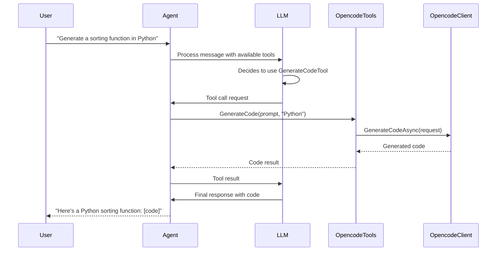

# Integration Option 2: OpencodeAI as Agent Framework Tools

> **TODO: REWRITE REQUIRED FOR LOCAL SERVER MODEL**
>
> This document was written for a **cloud API version** of OpencodeAI that had specialized methods like `GenerateCodeAsync()`, `ExplainCodeAsync()`, `ReviewCodeAsync()`, etc.
>
> The actual **local server API** (`opencode serve`) is fundamentally different:
> - Session-based conversations (not method-based)
> - Generic message sending via `POST /session/{id}/message`
> - The AI (configured in OpenCode) decides what to do based on the prompt
> - No specialized endpoints for "generate", "review", "explain"
>
> **To adapt this for local server:**
> - Tools would expose session/message operations, not specialized code methods
> - Example tools: `SendPromptTool`, `CreateSessionTool`, `ListFilesTool`, `SearchCodeTool`
> - The value proposition may be different since OpenCode itself is already AI-powered
>
> **Status**: Deferred to v1.1+ pending demand and redesign
>
> **See**: `/plan/backlog/option-2-tools-redesign.md` for tracking

---

## Overview

Register OpencodeAI client methods as tools (functions) that any Microsoft Agent Framework agent can invoke. This allows agents powered by OpenAI, Anthropic, Azure OpenAI, or other providers to delegate code-specific tasks to OpencodeAI's specialized capabilities.

## Architecture

```
┌─────────────────────────────────────────┐
│     Microsoft Agent Framework Agent     │
│  (OpenAI, Anthropic, Azure OpenAI, etc) │
└────────────────┬────────────────────────┘
                 │
                 │ Calls tools when needed
                 ▼
┌─────────────────────────────────────────┐
│        OpencodeAI Function Tools        │
├─────────────────────────────────────────┤
│ • GenerateCodeTool                      │
│ • ExplainCodeTool                       │
│ • ReviewCodeTool                        │
│ • RefactorCodeTool                      │
│ • StreamCodeTool                        │
└────────────────┬────────────────────────┘
                 │
                 │ Delegates to
                 ▼
┌─────────────────────────────────────────┐
│          IOpencodeClient                │
└─────────────────────────────────────────┘
```

## Key Benefits

1. **Universal Access**: Any Agent Framework agent can use OpencodeAI capabilities
2. **Automatic Tool Selection**: LLMs decide when to use OpencodeAI based on context
3. **Specialization**: OpencodeAI becomes the code expert while other agents handle general tasks
4. **Model Flexibility**: Use cheaper/faster models for general chat, OpencodeAI for code
5. **Hybrid Intelligence**: Combine multiple AI providers' strengths in one workflow

## Implementation

### Step 1: Create OpencodeAI Tool Wrapper

```csharp
using Microsoft.Extensions.AI;
using OpencodeAI;
using OpencodeAI.Models.Requests;
using OpencodeAI.Analysis;

public class OpencodeTools
{
    private readonly IOpencodeClient _client;

    public OpencodeTools(IOpencodeClient client)
    {
        _client = client;
    }

    [Description("Generate code based on a natural language description")]
    public async Task<string> GenerateCode(
        [Description("Natural language description of code to generate")] string prompt,
        [Description("Programming language (e.g., CSharp, Python, JavaScript)")] string language,
        CancellationToken cancellationToken = default)
    {
        var request = new GenerateCodeRequest
        {
            Prompt = prompt,
            ProgrammingLanguage = Enum.Parse<ProgrammingLanguage>(language, ignoreCase: true)
        };

        var response = await _client.GenerateCodeAsync(request, cancellationToken);
        return response.Code;
    }

    [Description("Explain what a code snippet does")]
    public async Task<string> ExplainCode(
        [Description("Code to explain")] string code,
        [Description("Programming language")] string language,
        [Description("Detail level: Brief, Normal, Detailed, or Comprehensive")]
        string detailLevel = "Normal",
        CancellationToken cancellationToken = default)
    {
        var result = await _client.ExplainCodeAsync(
            code,
            Enum.Parse<ProgrammingLanguage>(language, ignoreCase: true),
            detailLevel: Enum.Parse<DetailLevel>(detailLevel, ignoreCase: true),
            cancellationToken: cancellationToken);

        return $"Summary: {result.Summary}\n\nDetails: {result.DetailedExplanation}";
    }

    [Description("Review code for issues and provide suggestions")]
    public async Task<string> ReviewCode(
        [Description("Code to review")] string code,
        [Description("Programming language")] string language,
        [Description("Review focus areas (comma-separated): Security, Performance, Style, BugRisk")]
        string focusAreas = "Security,BugRisk",
        CancellationToken cancellationToken = default)
    {
        var focus = focusAreas.Split(',')
            .Select(f => Enum.Parse<ReviewFocus>(f.Trim(), ignoreCase: true))
            .Aggregate((a, b) => a | b);

        var result = await _client.ReviewCodeAsync(
            code,
            Enum.Parse<ProgrammingLanguage>(language, ignoreCase: true),
            focus: focus,
            cancellationToken: cancellationToken);

        var issues = string.Join("\n", result.Issues.Select(i =>
            $"[{i.Severity}] Line {i.Line}: {i.Description}"));

        var suggestions = string.Join("\n", result.Suggestions.Select(s =>
            $"• {s.Description}"));

        return $"Code Quality Score: {result.Score}/10\n\n" +
               $"Issues:\n{issues}\n\n" +
               $"Suggestions:\n{suggestions}";
    }

    [Description("Suggest refactoring improvements for code")]
    public async Task<string> SuggestRefactoring(
        [Description("Code to refactor")] string code,
        [Description("Programming language")] string language,
        [Description("Refactoring goals (comma-separated): Readability, Performance, Maintainability")]
        string goals = "Readability,Maintainability",
        CancellationToken cancellationToken = default)
    {
        var refactoringGoals = goals.Split(',')
            .Select(g => Enum.Parse<RefactoringGoal>(g.Trim(), ignoreCase: true))
            .Aggregate((a, b) => a | b);

        var result = await _client.SuggestRefactoringAsync(
            code,
            Enum.Parse<ProgrammingLanguage>(language, ignoreCase: true),
            goal: refactoringGoals,
            cancellationToken: cancellationToken);

        return $"Reasoning: {result.Reasoning}\n\n" +
               $"Before:\n```{language}\n{result.BeforeCode}\n```\n\n" +
               $"After:\n```{language}\n{result.AfterCode}\n```\n\n" +
               $"Explanation: {result.Explanation}";
    }
}
```

### Step 2: Register Tools with Agent

```csharp
using Microsoft.Agents.AI;
using Microsoft.Extensions.AI;
using Azure.AI.OpenAI;
using Azure.Identity;

// Create OpencodeAI client
var opcodeClient = new OpencodeClient("oc_sk_your_api_key");

// Create tools from OpencodeAI wrapper
var toolsFactory = new AIFunctionFactory();
var opcodeTools = toolsFactory.CreateFromObject(new OpencodeTools(opcodeClient));

// Create agent with OpenAI (or any other provider)
var endpoint = Environment.GetEnvironmentVariable("AZURE_OPENAI_ENDPOINT")!;
var deploymentName = Environment.GetEnvironmentVariable("AZURE_OPENAI_DEPLOYMENT_NAME")!;

var agent = new AzureOpenAIClient(new Uri(endpoint), new AzureCliCredential())
    .GetChatCompletionClient(deploymentName)
    .CreateAIAgent(
        name: "DevAssistant",
        instructions: "You are a helpful development assistant. Use the code tools when users ask about code.",
        tools: opcodeTools);

// Agent can now use OpencodeAI tools automatically
var response = await agent.RunAsync(
    "Generate a C# function to validate email addresses using regex");

Console.WriteLine(response);
```

### Step 3: Use with Dependency Injection

```csharp
// Program.cs
var builder = WebApplication.CreateBuilder(args);

// Register OpencodeAI
builder.Services.AddOpencodeClient(options =>
{
    options.ApiKey = builder.Configuration["OpenCode:ApiKey"];
});

// Register OpencodeTools
builder.Services.AddSingleton<OpencodeTools>();

// Register tools factory
builder.Services.AddSingleton(sp =>
{
    var opcodeTools = sp.GetRequiredService<OpencodeTools>();
    var factory = new AIFunctionFactory();
    return factory.CreateFromObject(opcodeTools).ToList();
});

// Register agent
builder.Services.AddSingleton(sp =>
{
    var chatClient = ...; // Your chat client
    var tools = sp.GetRequiredService<List<AIFunction>>();

    return chatClient.CreateAIAgent(
        name: "DevAssistant",
        tools: tools);
});
```

## Usage Examples

### Example 1: Code Generation Task

```csharp
var thread = agent.GetNewThread();

var response = await agent.RunAsync(
    "I need a Python function that reads a CSV file and converts it to JSON",
    thread);

// Agent automatically calls GenerateCodeTool with:
// - prompt: "function that reads a CSV file and converts it to JSON"
// - language: "Python"

Console.WriteLine(response);
// Output: Here's a Python function that does that:
// [generated code from OpencodeAI]
```

### Example 2: Code Review Workflow

```csharp
var code = @"
def process_data(data):
    result = []
    for i in range(len(data)):
        if data[i] > 0:
            result.append(data[i] * 2)
    return result
";

var response = await agent.RunAsync(
    $"Please review this Python code for issues:\n{code}",
    thread);

// Agent automatically calls ReviewCodeTool
// Returns issues found by OpencodeAI
```

### Example 3: Multi-Step Conversation

```csharp
var thread = agent.GetNewThread();

// Step 1: Generate initial code
await agent.RunAsync(
    "Generate a TypeScript class for a shopping cart",
    thread);

// Step 2: Explain the code
await agent.RunAsync(
    "Can you explain how the addItem method works?",
    thread);
// Agent remembers previous code and calls ExplainCodeTool

// Step 3: Improve the code
var response = await agent.RunAsync(
    "Refactor this to be more maintainable",
    thread);
// Agent calls SuggestRefactoringTool
```

## Tool Invocation Flow



## Advanced Patterns

### Pattern 1: Streaming Code Generation

```csharp
public class OpencodeStreamingTools
{
    [Description("Generate code with streaming progress")]
    public async IAsyncEnumerable<string> StreamGenerateCode(
        string prompt,
        string language,
        [EnumeratorCancellation] CancellationToken cancellationToken = default)
    {
        var request = new GenerateCodeRequest
        {
            Prompt = prompt,
            ProgrammingLanguage = Enum.Parse<ProgrammingLanguage>(language, true)
        };

        await foreach (var chunk in _client.StreamCodeAsync(request, cancellationToken))
        {
            yield return chunk.Code;
        }
    }
}
```

### Pattern 2: Context-Aware Tools

```csharp
public class ContextAwareOpencodeTools
{
    private readonly IOpencodeClient _client;
    private readonly Dictionary<string, string> _codeContext = new();

    [Description("Generate code with awareness of previous code in the conversation")]
    public async Task<string> GenerateCodeWithContext(
        string prompt,
        string language,
        string? relatedCodeKey = null,
        CancellationToken cancellationToken = default)
    {
        var fullPrompt = prompt;

        // Include related code from context if specified
        if (relatedCodeKey != null && _codeContext.TryGetValue(relatedCodeKey, out var relatedCode))
        {
            fullPrompt = $"Building on this existing code:\n{relatedCode}\n\n{prompt}";
        }

        var result = await _client.GenerateCodeAsync(
            new GenerateCodeRequest { Prompt = fullPrompt, ... },
            cancellationToken);

        // Store generated code for future context
        _codeContext[$"{language}_{DateTime.UtcNow.Ticks}"] = result.Code;

        return result.Code;
    }
}
```

### Pattern 3: File Operations Integration

```csharp
public class OpencodeFileTools
{
    private readonly IOpencodeClient _client;

    [Description("Read a code file, analyze it, and suggest improvements")]
    public async Task<string> AnalyzeFile(
        string filePath,
        CancellationToken cancellationToken = default)
    {
        // Read file
        var fileContent = await _client.ReadFileAsync(
            new ReadFileRequest { Path = filePath },
            cancellationToken);

        // Review code
        var review = await _client.ReviewCodeAsync(
            fileContent.Content,
            fileContent.Language,
            cancellationToken: cancellationToken);

        // Suggest refactoring
        var refactoring = await _client.SuggestRefactoringAsync(
            fileContent.Content,
            fileContent.Language,
            cancellationToken: cancellationToken);

        return $"File: {filePath}\n" +
               $"Review Score: {review.Score}/10\n" +
               $"Issues: {review.Issues.Count}\n" +
               $"Refactoring Suggestions: {refactoring.Reasoning}";
    }
}
```

## Comparison with Other Options

| Aspect | Tools Approach | OpencodeAgent (Option 1) |
|--------|---------------|-------------------------|
| **Flexibility** | Any agent can use OpencodeAI | OpencodeAI is the agent |
| **Model Choice** | Use any LLM, delegate to OpencodeAI | OpencodeAI model only |
| **Cost** | Use cheaper models + OpencodeAI when needed | All requests to OpencodeAI |
| **Complexity** | Simple - just register tools | Moderate - implement AIAgent |
| **Control** | LLM decides when to use tools | Direct control over OpencodeAI |
| **Multi-Agent** | One agent with tools | Multiple agents coordinating |

## Best Use Cases

1. **Mixed Workloads**: General chat + occasional code tasks
2. **Cost Optimization**: Use GPT-3.5 for chat, OpencodeAI for code
3. **Existing Agents**: Add code capabilities to existing Agent Framework agents
4. **Tool Ecosystem**: OpencodeAI as one of many specialized tools
5. **Automatic Delegation**: Let LLM decide when code expertise is needed

## Limitations

1. **Tool Call Overhead**: Each code operation requires an LLM tool call decision
2. **Context Handling**: Harder to maintain code context across multiple tools
3. **Streaming Limitations**: Some Agent Framework versions may not support streaming tools
4. **Error Handling**: Tool failures must be handled by the LLM agent

## Next Steps

1. Implement `OpencodeTools` wrapper class
2. Create integration tests with different agent providers
3. Add telemetry for tool usage tracking
4. Document best practices for tool descriptions
5. Consider adding more specialized tools (e.g., `FixBugTool`, `OptimizeCodeTool`)
